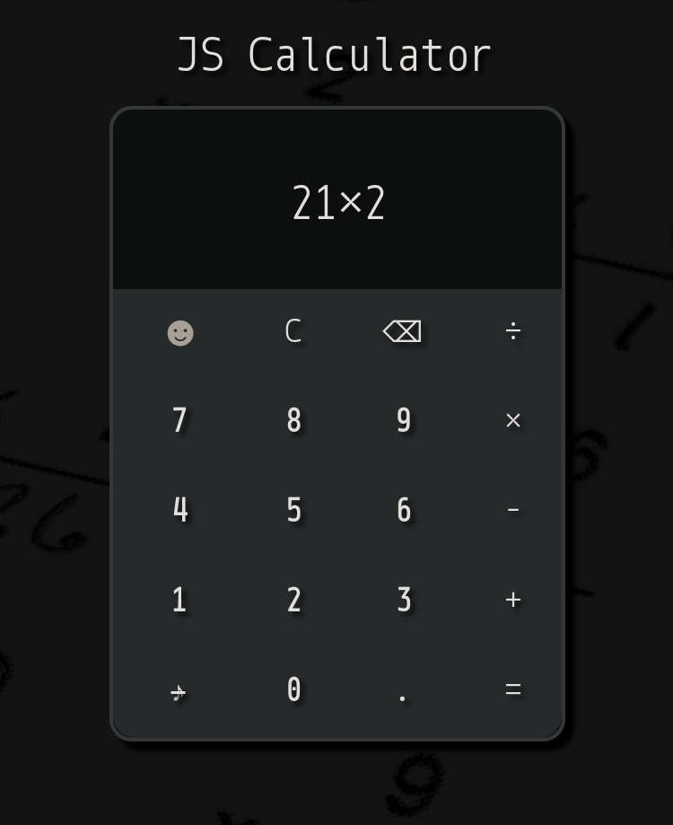

# JavaScript Calculator

## Welcome to the calculator of your dreams!

Sort of.

This is an exercise from Social Hackers Academy where I first brought HTML, CSS and JS together. I also learned some interesting things about the power of regular expressions through this. Overall, quite a fun project!

## Instructions:

Click the buttons with your mouse to get your result. Click the sound/note button to get some retro bleeps.

## Issues / TO-DO:

Keyboard input currently not enabled. 
Probably works best for resolutions higher than 1080p.

